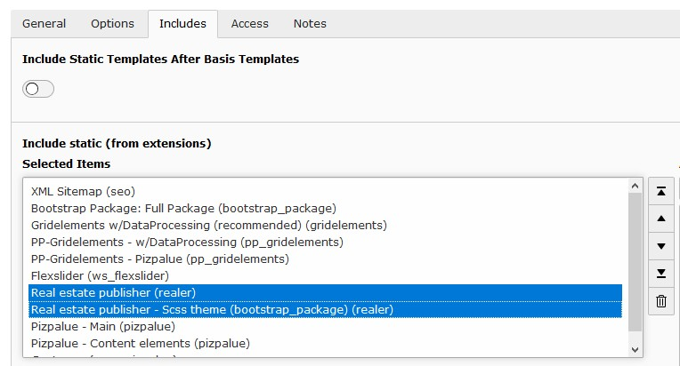
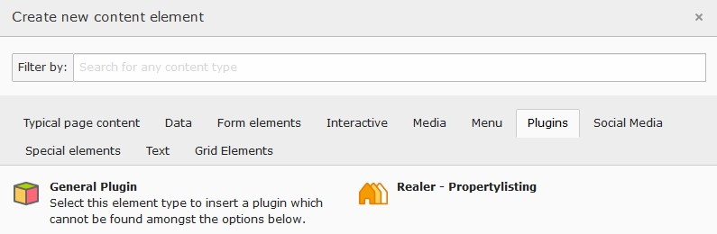

.. ==================================================
.. FOR YOUR INFORMATION
.. --------------------------------------------------
.. -*- coding: utf-8 -*- with BOM.

.. include:: ../Includes.txt

.. _admin-manual:

====================
Administrator Manual
====================

.. _admin-installation:

Installation
============

Install the extension through the extension manager.

.. _admin-configuration:

Configuration
=============

Template
--------

After installing the extension the related template should be included:

   Include static template from extension

In case your site is based on bootstrap 3 you might include the default
theme too.

.. _admin-configuration-storage:

Storage
-------

To manage the real estate objects a storage location might be defined as
following:

#. Create a storage folder
#. In the constant editor select "PLUGIN.TX_REALER_OBJECTLISTING"
#. Set the "Default storage PID" to the uid from the storage folder (the uid is
   shown when hovering ofer the folder icon).

   Define real estate object storage

.. _admin-configuration-page_structure:

Page structure
--------------

There are various page structures possible. As an example the following could
be used:

   Page structure

.. _admin-configuration-content_element:

Content element
---------------

Add the plugin to a page (in the example page structure above it would be on
page named 'Objects'):

   Add the plugin to a page

.. _admin-configuration-menu:

Menu
----

The available property types (available as soon as a property has assigned an
object type) can be gathered by the provided menu processor. Depending on the
configuration just the propery type items are obtained or attached to an
existing menu.

**Just render property types menu**

.. code-block:: typoscript

   lib.propertyMenu = FLUIDTEMPLATE
   lib.propertyMenu {
      templateName = PropertyMenu
      templateRootPaths {
         10 = EXT:realer/Resources/Private/Templates
      }
      dataProcessing {
         10 = Buepro\Realer\DataProcessing\MenuProcessor
         10 {
            as = propertyMenu
            menuTargetPageUid = 66
         }
      }
   }

A possible fluid template could look as following:

::

 <f:if condition="{propertyMenu -> f:count()}">
    <ul class="tx-realer-propertymenu">
       <f:for each="{propertyMenu}" as="propertyType">
          <li class="{f:if(condition:propertyType.current,then:'current')}
                   {f:if(condition:propertyType.active,then:' active')}">
             <a href="{propertyType.link}">{propertyType.title}</a>
          </li>
       </f:for>
    </ul>
 </f:if>

**Attach property types to menu (e.g. from bootstrap_package)**

.. code-block:: typoscript

   page {
      10.dataProcessing {
         # mainnavigation
         10 = Buepro\Realer\DataProcessing\MenuProcessor
         10 {
            menuTargetPageUid = 66
            menuPid = 66
         }
         # subnavigation
         20 = Buepro\Realer\DataProcessing\MenuProcessor
         20 {
            menuTargetPageUid = 66
            menuPid = 66
         }
      }
   }
