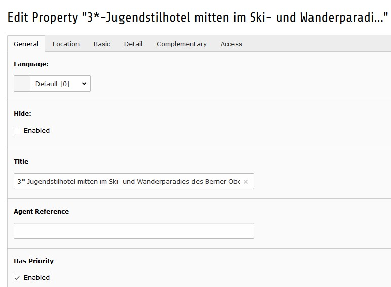

.. ==================================================
.. FOR YOUR INFORMATION
.. --------------------------------------------------
.. -*- coding: utf-8 -*- with BOM.

.. include:: ../Includes.txt

.. _introduction:

============
Introduction
============

.. _intro-what_it_does:

What does it do?
================

By help of this extension real estate properties like houses, flats,
hotels, etc. are published (shown).

Several fields are provided to define the properties characteristics. Just
defined fields will as well be shown on the web site.

By help of the provided menu processor the object navigation might be smoothly
integrated into the site's menu.

A default theme for bottstrap 3 based web sites is included. For other sites
a style definition needs to be provided.

.. _intro-screenshots:

Screenshots
===========

Frontend
--------

   Object listing

----

   Detail view

----

   Menu integration

Backend
-------

   Object editing in backend
