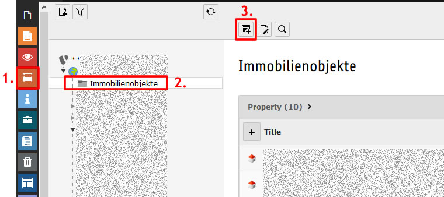
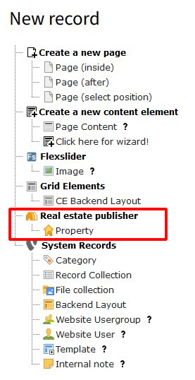
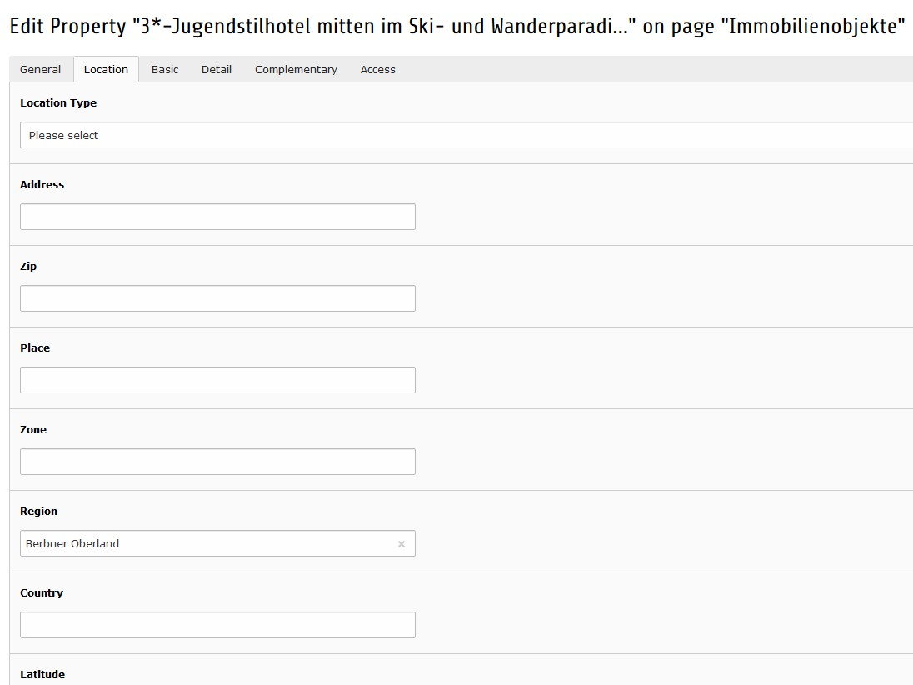
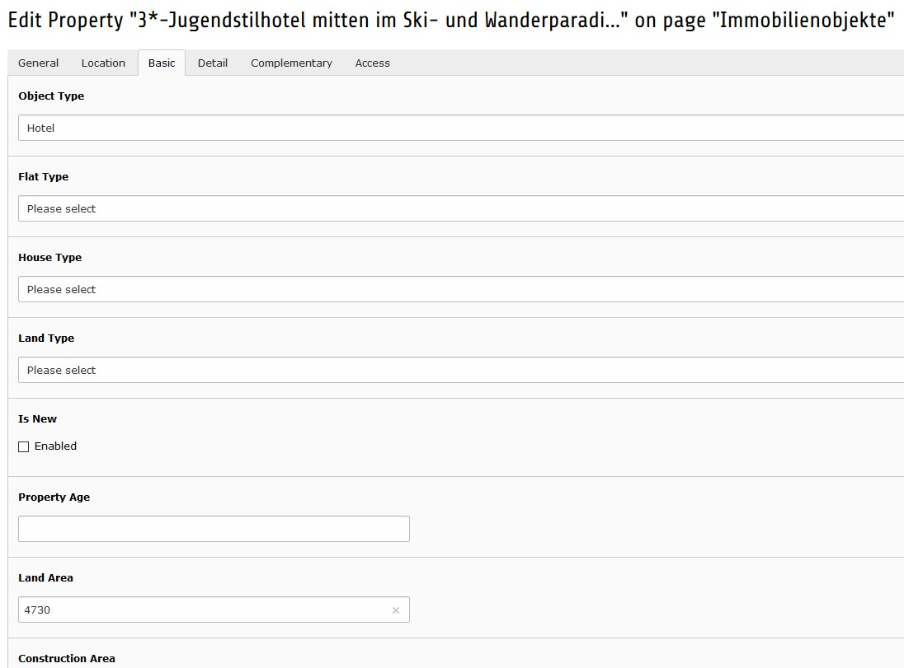
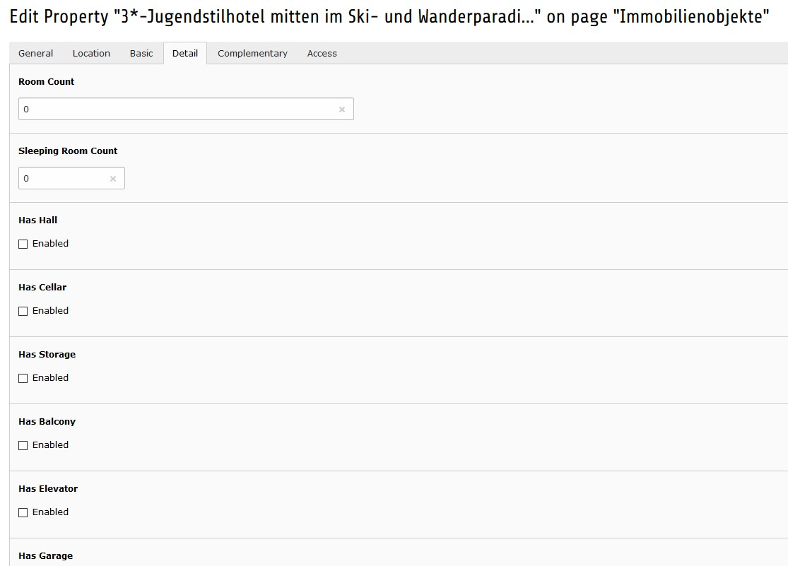
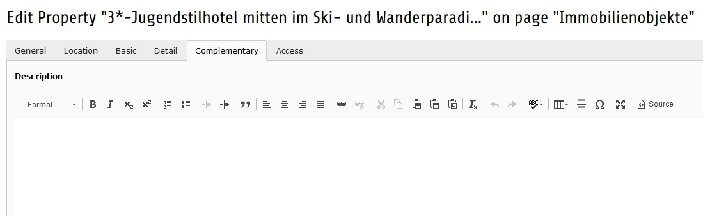

.. ==================================================
.. FOR YOUR INFORMATION
.. --------------------------------------------------
.. -*- coding: utf-8 -*- with BOM.

.. include:: ../Includes.txt

.. _user-manual:

============
Users Manual
============

After :ref:`installing the extension <admin-installation>` and :ref:`configuring the
plugin <admin-configuration>` the properties might be defined at the foreseen
page/folder.

.. _user-add_record:

Add record to page/storage
==========================

   Add record to page

----

   Add property record

.. _user-define_record:

Define propery record
=====================

.. note::
   Just defined items will be shown in the frontend

.. figure:: ../Images/UserManual/DefineRecord_General.jpg
   :width: 600px
   :alt: Define general characteristics

   Define general characteristics

.. note::
   Properties having marked 'Has Priority' will be shown first on the list view.

----

   Define location

----

   Define basic characteristics

----

   Define further details

----

   Define complementary description
